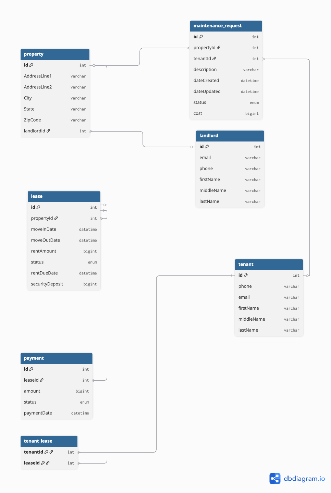

# Properly — Data Model Design Document

## Diagram

---

## Overview

This document describes the database schema for Properly's MVP, covering rent collection, lease tracking, and maintenance request management. The model is designed around the core entities in a landlord-tenant relationship.

---

## Tables & Relationships

### `landlord`
Represents a landlord who owns one or more properties. Stores basic contact and identity information. A landlord account will eventually link to a `users` record for authentication via Spring Security.

---

### `property`
Represents a physical rental property. Each property is owned by exactly one landlord, established via the `landlordId` foreign key.

**Relationships:**
- Many-to-one with `landlord` — a landlord can own multiple properties, but each property belongs to one landlord.

---

### `tenant`
Represents a tenant renting a property. Stores basic contact and identity information. Like `landlord`, a tenant will eventually link to a `users` record for authentication.

**Relationships:**
- Many-to-many with `lease` via the `tenant_lease` junction table — a lease can have multiple tenants (e.g. a married couple), and a tenant can be associated with multiple leases over time (e.g. past and present leases).

---

### `lease`
Represents a rental agreement between one or more tenants and a property. Tracks the terms of the agreement including rent amount, due date, security deposit, and lease status.

**Relationships:**
- Many-to-one with `property` — a property can have multiple leases over time, but each lease belongs to one property.
- Many-to-many with `tenant` via `tenant_lease`.
- One-to-many with `payment` — a lease generates one payment per billing cycle over its lifetime.

---

### `tenant_lease`
Junction table that resolves the many-to-many relationship between `tenant` and `lease`. Uses a composite primary key of `(tenantId, leaseId)` to enforce uniqueness and prevent duplicate associations.

**Relationships:**
- Many-to-one with `tenant`
- Many-to-one with `lease`

---

### `payment`
Represents a single rent payment made against a lease. Lateness is derived at the application layer by comparing `paymentDate` against the parent lease's `rentDueDate` — no redundant boolean is stored.

**Relationships:**
- Many-to-one with `lease` — a lease has many payments over its lifetime, but each payment belongs to one lease.

---

### `maintenance_request`
Represents a maintenance request submitted by a tenant for a specific property. Tracks the description, status, cost, and timestamps for creation and updates.

**Relationships:**
- Many-to-one with `property` — a property can have many maintenance requests.
- Many-to-one with `tenant` — a tenant can submit many maintenance requests over time.

---
